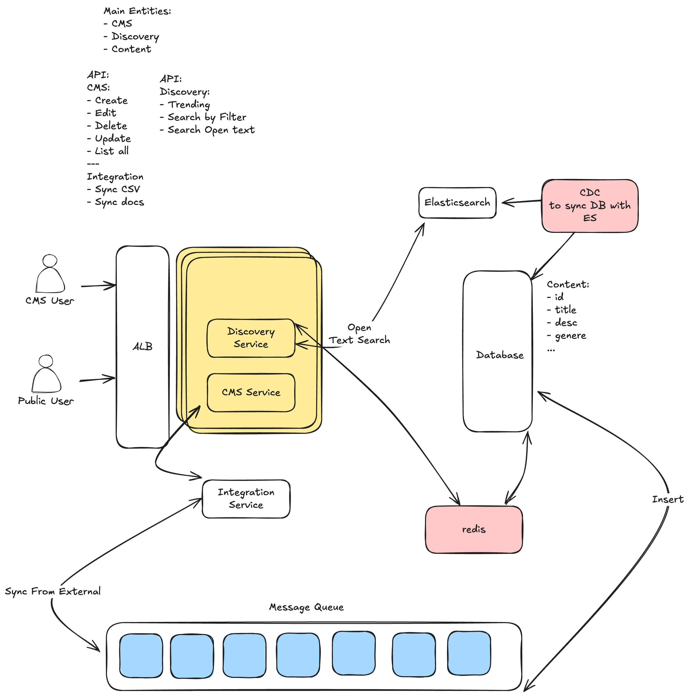

## 🧾 المستند التقني – حل التكليف

### 📌 التقنية المستخدمة:

- **NestJS** كإطار عمل أساسي لتنظيم المشروع وبنية الوحدات.
- **Prisma ORM** للتعامل مع قاعدة البيانات.
- **PostgreSQL** كقاعدة بيانات علائقية.
- **Redis** لتحسين الأداء عن طريق التخزين المؤقت (caching).

---

### ⚙️ نظرة على التصميم:

اعتمدت تقسيم المشروع إلى وحدات - Modules - واضحة وفقًا لوظيفة كل جزء:

- **CmsModule**: مسؤول عن تمكين المحررين من إنشاء وتعديل المحتوى.
- **DiscoveryModule**: مسؤول عن استعراض المحتوى للزوار والبحث فيه.
- **ContentModule**: يحتوي منطق إدارة الحلقات ومخزن البيانات (service + model).

> جميع الوحدات مصممة لتكون منخفضة الترابط (Low Coupling) وبمسؤوليات واضحة (Single Responsibility).

---

### 😓 الصعوبات التي واجهتها:

1. **تحديد مسؤوليات كل وحدة بدقة**:

   - كان من التحديات في البداية: "هل أضع منطق البحث داخل ContentModule أم أفصله؟"
   - كذلك الفصل بين CMS وDiscovery كان يتطلب وضوح في منطق التفاعل مع الـ ContentService بدون تكرار أو تعارض.

2. **تصميم Search بشكل قابل للتوسعة**:

   - أردت بدء المشروع بـ PostgreSQL، لكن مع إبقاء المجال مفتوحًا للانتقال لاحقًا إلى Elasticsearch بدون تغيير في الـ Controller أو الـ Service.

3. **تنسيق Swagger + كتابة DTOs بدقة**:

   - ضمان أن كل endpoint موثّق بشكل صحيح وسهل الفهم للمطورين الآخرين.

---

### 💡 أفكار للتحسين أو التوسعة المستقبلية:

- **إدخال Elasticsearch** لتحسين نتائج البحث ودعم مزايا مثل التصحيح التلقائي والتكملة.
- **إضافة ImportService** يسمح بإدخال الحلقات من مصادر خارجية بشكل آمن ومنظم.
- **توسعة نظام الصلاحيات (RBAC)** لتمييز الأدوار بين المحررين والمراجعين والمديرين.
- **وضع Layer مخصصة للـ analytics** (مثل عدد المشاهدات، المتابعة، إلخ) مفصولة عن منطق الحلقة الأساسي.
- **توسعة اختبارات E2E** لتغطية المزيد من سيناريوهات الاستخدام وضمان جودة الكود.

---

### ✅ خلاصة:

ركزت في هذا الحل على النظافة المعمارية، قابلية التوسعة، واستخدام تقنيات واقعية تُستخدم في الإنتاج. التحديات في فصل المسؤوليات كانت مهمة ومفيدة لتصميم بنية قابلة للنمو، ومتماسكة في المدى الطويل.
